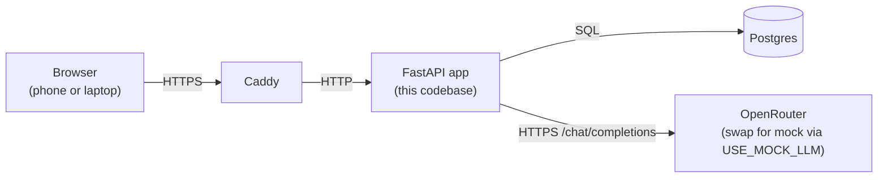
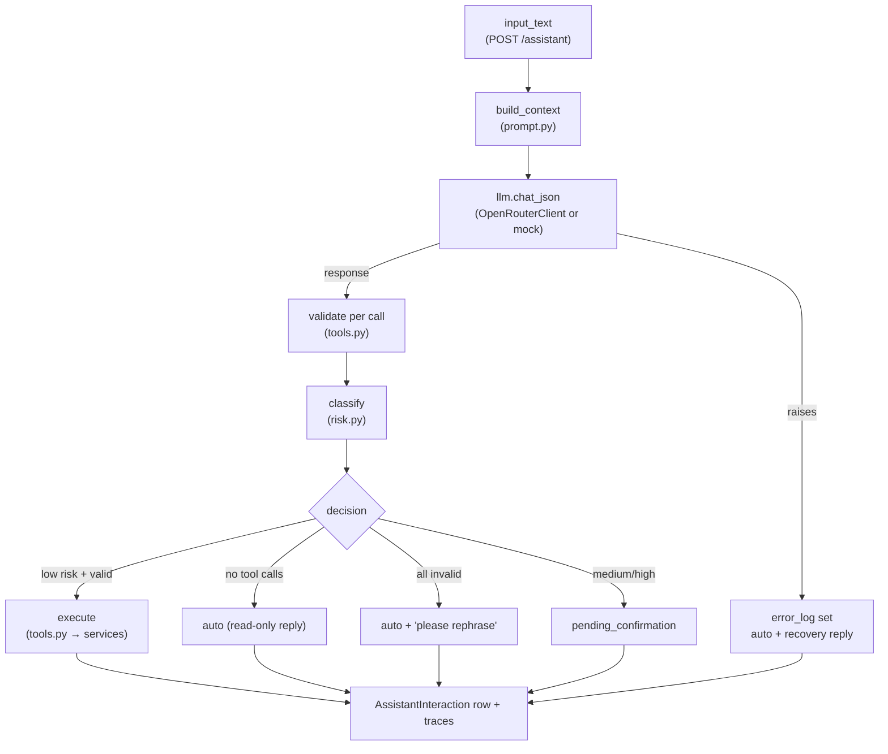

# Architecture

How the codebase fits together. For *what* the app does, see [`PRD_AND_ROADMAP.md`](PRD_AND_ROADMAP.md); for running it, [`SETUP.md`](SETUP.md) / [`OPERATIONS.md`](OPERATIONS.md).

## Mental model

A single FastAPI process talking to one Postgres database, with LLM calls going out to OpenRouter (an OpenAI-compatible cloud API). Everything is server-rendered HTML — no separate frontend build. The stack runs in Docker Compose on a cloud VPS (`compose.cloud.yml`: app + postgres + caddy).



Inside the process, the layout is **one Python package per domain**: `grocery/`, `meal_plan/` (incl. the recipe catalog), `lunch_plan/`, `household_task/`, `lessons/`, `projects/`, `exercise/`, `hike/`, `bp/`, `memory/`, `family_member/`, `auth/`, `dashboard/`, `assistant/`, plus the shared `ai_gateway/`. Each module owns its DB tables, HTTP routes, HTML templates, and (for assistant-writable modules) its tool definitions.

## Runtime composition

Entry point: [`src/family_assistant/main.py`](src/family_assistant/main.py). `app = FastAPI(... dependencies=[Depends(require_csrf)])` — CSRF runs on **every** request via an app-wide dependency; each module's router is then included. The lifespan handler seeds the two adult users from `.env` so a fresh deploy can sign in immediately.

Routes follow one shape: `@router.get` renders a page; `@router.post` accepts a form (`Annotated[str, Form()]`, not JSON models), calls a service function, and 303-redirects (Post-Redirect-Get). Pydantic is used heavily only inside the AI Gateway, where the input *is* JSON.

FastAPI features leaned on: **dependency injection** (`Annotated[X, Depends(get_X)]` for DB session, current user, LLM client — tests swap via `app.dependency_overrides`) and **routers** (`APIRouter(prefix=..., dependencies=[Depends(require_user)])` applies auth per module in one place). Everything is synchronous inside handlers; no BackgroundTasks yet.

## Database — PostgreSQL + SQLAlchemy 2.x

[`db.py`](src/family_assistant/db.py) defines `Base(DeclarativeBase)`, plus lazy `get_engine()` / `get_sessionmaker()` (`lru_cache`'d — engine construction happens at first use, not import, so tests can collect without a `.env`) and the `get_session()` request-scoped dependency.

Each module owns a `models.py` (SQLAlchemy 2.x typed style: `Mapped[T]` + `mapped_column`) and a `services.py` with the actual DB operations. **Routers never write SQL** — they call services. This boundary matters because the AI Gateway dispatches into the *same* service functions; there is no parallel mutation path for the LLM. JSON columns are `JSONB` (e.g. `LunchPlanEntry.items`); derived values (`work_score`, `map_value`, `speed_kmh`) are computed at write time and persisted so history doesn't drift.

## Migrations — Alembic

Schema history is the linear chain in [`alembic/versions/`](alembic/versions/) (currently 0001–0024); Postgres tracks the applied revision in `alembic_version`. [`alembic/env.py`](alembic/env.py) imports every module's `models` package so `Base.metadata` is fully populated — adding a module means adding one import line there. Version files are hand-edited, not blindly autogenerated: run `uv run alembic revision --autogenerate -m "..."` then read the output (autogenerate misses enum changes and invents operations). Drift between models and migrations is caught by [`tests/test_migrations.py`](tests/test_migrations.py) via `compare_metadata` on every run.

## Templating — Jinja2

[`templating.py`](src/family_assistant/templating.py) exposes one `Jinja2Templates` instance; templates extend `base.html` for chrome. One Jinja global, `csrf_input()`, renders the hidden CSRF field in every form from `request.state.csrf_token`. Styling is Tailwind via CDN (no build step); HTMX is loaded but lightly used — most pages are plain form-POST + redirect; Alpine.js handles small UI state (menus, toggles).

## Auth and CSRF

Server-side sessions, no JWTs. `User` rows seed from `.env` (no sign-up). Login verifies the Argon2id hash and creates a `UserSession` row whose random token becomes the `fa_session` cookie (`httponly`, `secure`, `samesite=lax`). Every session row also carries a `csrf_token`; the app-wide [`require_csrf`](src/family_assistant/auth/dependencies.py) dependency stashes it on `request.state` and enforces it on unsafe methods (`/auth/login` exempt — nothing exploitable with two pre-seeded users). `require_user` is the per-router dependency returning the authenticated `User` or 401.

## Configuration — pydantic-settings

[`settings.py`](src/family_assistant/settings.py) defines `Settings(BaseSettings)`: typed fields from `.env` / environment (`database_url`, `session_secret`, `openrouter_*`, `use_mock_llm`, `user1_*`...). Validation happens at first `get_settings()` call (`lru_cache`'d) — a missing required value fails fast.

## The AI Gateway

All assistant intelligence lives in [`ai_gateway/`](src/family_assistant/ai_gateway/) — the only module with a hard external dependency (OpenRouter), deliberately isolated from the deterministic CRUD modules. Pieces, input to output:

- **`llm.py`** — `LLMClient` Protocol (`chat_json(messages) -> dict`). `OpenRouterClient` wraps `/chat/completions` over httpx with `response_format: json_object` and a 180 s read budget. Tests inject fakes.
- **`llm_mock.py`** — offline `MockLLMClient` (same Protocol), swapped in by `USE_MOCK_LLM=true`. Keyword-driven scenarios plus a `force_mode` hook (`blank_name`, `unknown_tool`, `hallucinated_fk`, `hard_restriction`, `bulk_grocery`, `crash`, ...) — each failure mode paired with the defense layer it exercises, which is what makes end-to-end pipeline tests tractable without an LLM.
- **`prompt.py`** — system prompt + JSON tool catalog + a per-command **context block** of pre-fetched DB state (open grocery items, this and next week's plans, the recipe catalog, up to 50 recent memories, the exercise catalog...). Reads are answered from context; there are no read-tool round-trips except `memory.search`.
- **`tools.py`** — the seven tools (`grocery.add_items`, `grocery.mark_purchased`, `meal_plan.create_entry`, `lunch_plan.create_entry`, `exercise.log_activity`, `memory.create`, `memory.search`), each a Pydantic args schema + a handler that delegates into the module service functions. Required string fields use a `NonEmptyStr` constraint so whitespace-only LLM output fails validation up front.
- **`risk.py`** — pure classifier per PRD §11.6: >3 calls or >3 grocery items → medium; hard-restriction memory → high; else low. Low executes automatically; medium/high stages for confirmation.
- **`gateway.py`** — the orchestrator: build prompt → call LLM → validate each call → classify risk → execute (low only) → persist. When validation rejects a call, the gateway overwrites any optimistic LLM reply so the user never sees "added" against an unsaved record. `confirm_pending` / `cancel_pending` extend the same interaction.
- **`models.py`** — `AssistantInteraction` (one row per call: input, proposed/executed calls, confirmation status, affected IDs, latency, error) and `InteractionTrace` (one row per pipeline-stage event, monotonic `ts_ms`, free-form JSONB payload). Together the debugging surface — one query keyed on `interaction_id` reconstructs a request, also rendered at `/assistant/interactions/{id}/trace` (owner-only; others' IDs 404).
- **`tracing.py`** — `TraceRecorder` buffers stage events during `process_command` and flushes them once the interaction row has an id.
- **`services.py`** — read helpers for the assistant UI and dashboard card (user-scoped).

The `/assistant` HTML surface ([`assistant/`](src/family_assistant/assistant/)) is a thin wrapper: form, confirmation card, history, trace page.



`confirmation_status` is a small state machine: `auto` (executed or terminal) or `pending_confirmation` → `approved` (re-validates, executes) / `cancelled`.

Embeddings/pgvector retrieval are deliberately deferred — household memory counts are small enough to put in the prompt directly.

## Domain module shape

```
src/family_assistant/<module>/
  __init__.py   # exports `router`
  models.py     # ORM tables
  services.py   # CRUD functions (the only place that writes SQL)
  router.py     # routes; calls services, renders templates
src/family_assistant/templates/<module>/
  list.html, form.html, ...
```

`dashboard` skips models/services (reads other modules); `assistant` skips models (data lives in `ai_gateway/models.py`).

## Testing

[`tests/conftest.py`](tests/conftest.py): the session-scoped `engine` fixture connects to `family_assistant_test` (reading `DATABASE_URL` straight from the environment, with an instructive failure if unset), drops/recreates the `public` schema, and runs **all Alembic migrations** — tests exercise the same schema-construction path as production. The per-test `db_session` wraps everything in an outer transaction with `join_transaction_mode="create_savepoint"`, so in-handler `commit()`s become savepoints and teardown rolls the DB back — full isolation while exercising real commit-path behavior.

`client` overrides `get_session`; `authenticated_client` logs in and auto-includes the CSRF token. Fake LLMs: a local `FakeLLM` returning a canned dict for unit-style tests, or `MockLLMClient(force_mode=...)` for end-to-end failure paths through the real validation/risk/tracing layers. No network is ever required.

## Dev tooling

`uv` (deps: `uv sync --extra dev`), `ruff` (lint + format; config in `pyproject.toml`), `pre-commit` (ruff, detect-secrets, hygiene hooks), `pytest` (`asyncio_mode = "auto"`).

## Deployment shape

`compose.cloud.yml` on the VPS: **app**, **postgres** (pgvector image, though vector columns are unused so far), and **caddy** for TLS. Only Caddy's ports are published. The Caddy service doubles as the VM's shared multi-tenant edge — external `caddy_net` network, `import sites/*.caddy`, static tenants under `/root/static` — see PRD §17.10. Deploys, backups (automated daily + off-box copies), and rollback are covered in `OPERATIONS.md`.
