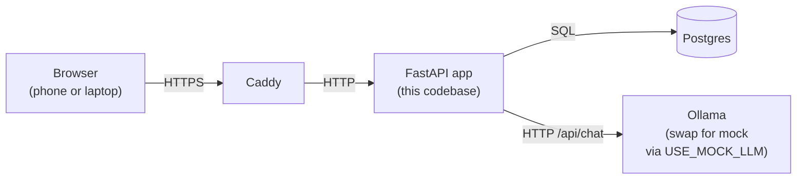
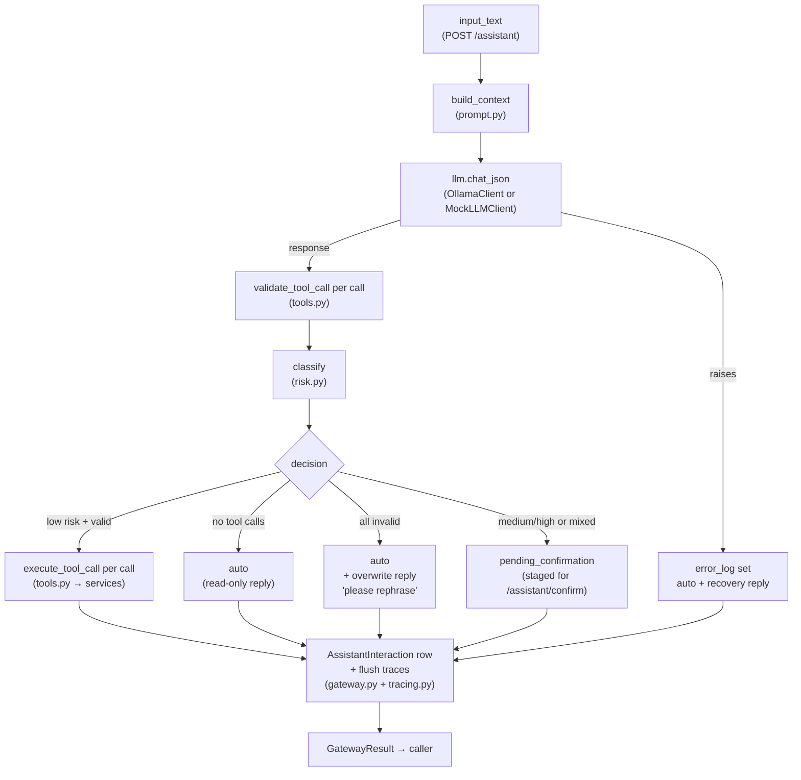
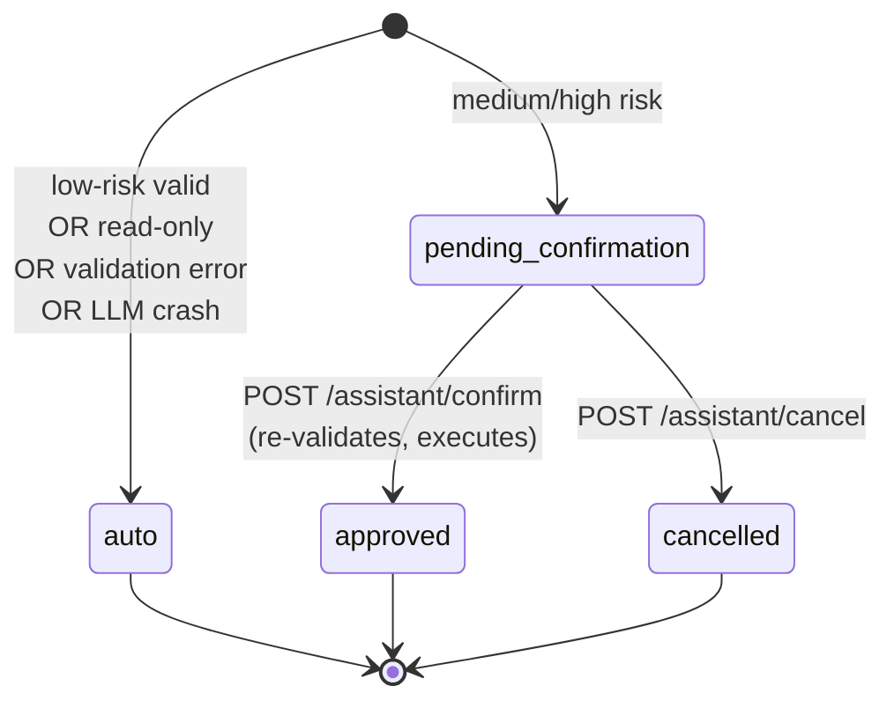

# Architecture

How the codebase fits together. For *what* the app is supposed to do, see
[`PRD_AND_ROADMAP.md`](PRD_AND_ROADMAP.md). For *how to run it*,
see [`README.md`](README.md). This doc is about *what each piece is and
why it's there*.

> **Deployment note:** the live LLM is now **OpenRouter** (cloud, OpenAI-compatible API) via `OpenRouterClient`; the app runs on a single cloud VPS (`compose.cloud.yml`). Mentions below of an **Ollama** container, `OllamaClient`, `compose.gpu.yml`, or a home GPU box describe the retired home deployment — the `LLMClient` Protocol and mock are unchanged.

---

## Mental model

The app is a single FastAPI process that talks to one Postgres database
and (optionally) one Ollama LLM container. Everything is server-rendered
HTML — there is no separate frontend build. The whole stack runs in Docker
Compose, the same containers at home and in the cloud.



Inside the FastAPI process the layout is **one Python package per
domain**: `grocery/`, `meal_plan/`, `lunch_plan/`, `exercise/`,
`memory/`, `family_member/`, `auth/`, `dashboard/`, `assistant/`, plus
the shared `ai_gateway/`. Each module owns its DB tables, HTTP routes,
HTML templates, and (for write modules) its assistant tool definitions.

---

## Runtime composition

Entry point: [`src/family_assistant/main.py`](src/family_assistant/main.py).

`app = FastAPI(... dependencies=[Depends(require_csrf)])` — the CSRF
check runs on **every** request via an app-wide dependency. Routers from
each module are then `app.include_router(...)`ed. The lifespan handler
(`async def lifespan`) seeds the two adult users from `.env` on startup
so a fresh deploy can sign in without manual user creation.

Routes mostly look the same shape:

- `@router.get("", response_class=HTMLResponse)` — render a list/page.
- `@router.post(...)` — accept a form, call a service-layer function,
  `RedirectResponse(... status_code=303)` (Post-Redirect-Get).

Form bodies use `Annotated[str, Form()]` instead of separate Pydantic
request models, because the input is HTML forms, not JSON. Pydantic *is*
used heavily inside the AI Gateway, where the input is LLM-produced JSON.

---

## Web framework — FastAPI

FastAPI is a Python web framework built on Starlette (the ASGI server
adapter) and Pydantic (validation). Two things we use heavily:

- **Dependency injection** — `Annotated[X, Depends(get_X)]` resolves
  shared concerns (DB session, current user, LLM client) without an
  application context object. Tests swap these with
  `app.dependency_overrides[get_X] = ...`.
- **Routers** — `APIRouter(prefix=..., dependencies=[Depends(require_user)])`
  groups related endpoints and applies auth to all of them in one place.

There's no FastAPI BackgroundTasks usage yet; everything is synchronous
inside a request handler.

---

## Database layer — PostgreSQL + SQLAlchemy 2.x

PostgreSQL holds all application state. SQLAlchemy 2.x is the ORM.

[`src/family_assistant/db.py`](src/family_assistant/db.py) defines:

- `Base(DeclarativeBase)` — every ORM model subclasses this. The shared
  `Base.metadata` registry is what Alembic compares the live schema
  against.
- `engine` — one connection pool for the process, built from
  `DATABASE_URL`.
- `SessionLocal` — a session factory.
- `get_session()` — a FastAPI dependency that yields a request-scoped
  `Session`. Each request gets its own session; the `with` block closes
  it when the request ends.

Each module owns a `models.py` with its tables. Models use the SQLAlchemy
2.x style:

```python
class GroceryItem(Base):
    __tablename__ = "grocery_items"
    id: Mapped[int] = mapped_column(primary_key=True)
    name: Mapped[str] = mapped_column(String(200))
    status: Mapped[str] = mapped_column(String(20), default="open")
    ...
```

`Mapped[T]` + `mapped_column(...)` is the modern typed mapper API.
`relationship(...)` declares cross-table joins. Querying is via
`select(Model).where(...)` passed to `db.scalars(...)`.

For each module there is also a `services.py` with the actual DB
operations (`create_X`, `list_X`, `mark_X_purchased`...). **Routers
never write SQL directly** — they delegate to a service function. This
boundary matters because the AI Gateway dispatches into the same service
functions; there is no parallel mutation path for the LLM.

JSON columns use PostgreSQL `JSONB` (e.g., `LunchPlanEntry.items`,
`AssistantInteraction.proposed_tool_calls`). Free-text array columns
use `ARRAY(String)` (e.g., `FamilyMember.school_days`).

---

## Schema migrations — Alembic

Alembic is the migration tool that ships with SQLAlchemy. It tracks the
DB schema as an ordered chain of Python files in
[`alembic/versions/`](alembic/versions/) — each one knows how to
`upgrade()` and `downgrade()` one step. Postgres has an
`alembic_version` table holding the id of the migration currently
applied; `alembic upgrade head` runs every pending migration in order.

Configuration lives in:

- [`alembic.ini`](alembic.ini) — top-level config (mostly defaults).
- [`alembic/env.py`](alembic/env.py) — wires Alembic to our codebase.
  This file **imports every module's `models` package** so that
  `Base.metadata` is fully populated before autogenerate compares
  it against the live schema. Adding a new module = adding one
  `from family_assistant.X import models as _X_models  # noqa: F401`
  line here.

The version files are deliberately hand-edited rather than blindly
generated. Migration 0001 created the auth tables; subsequent
migrations are one per concern (`0003_grocery_items`,
`0008_memories`, `0011_assistant_interactions`, ...). The chain must
stay linear (`down_revision = "0010_user_name"`) — never branch.

Drift between models and migrations is caught automatically by
[`tests/test_migrations.py`](tests/test_migrations.py), which runs
`compare_metadata(...)` between the live schema and `Base.metadata`
on every test run.

To generate a new migration: edit the model, then
`uv run alembic revision --autogenerate -m "what changed"`. Always
read the generated file — autogenerate misses things (e.g., enum
type changes, index renames) and sometimes invents unnecessary
operations.

---

## Templating — Jinja2

[`src/family_assistant/templating.py`](src/family_assistant/templating.py)
exposes one shared `Jinja2Templates` instance pointing at
`src/family_assistant/templates/`. Templates extend
[`base.html`](src/family_assistant/templates/base.html) for chrome
(nav, body shell).

One Jinja **global** is registered: `csrf_input()` — rendered in every
form to emit `<input type="hidden" name="_csrf" value="...">`. The
token comes from `request.state.csrf_token`, which the `require_csrf`
dependency sets when it finds a valid session.

UI styling is Tailwind via CDN (no build step). HTMX is loaded but not
yet used heavily — most pages are plain form-POST + redirect.

---

## Authentication and CSRF

Server-side sessions, no JWTs.

- `User` rows are seeded from `.env` at startup (no sign-up flow).
- Login (`POST /auth/login`) verifies the Argon2id password hash and
  creates a `UserSession` row keyed by a random token. That token is
  set as a `httponly`, `secure`, `samesite=lax` cookie named
  `fa_session`.
- Logout deletes the `UserSession` row and clears the cookie.
- Every `UserSession` row also has a `csrf_token`. The
  [`require_csrf`](src/family_assistant/auth/dependencies.py)
  app-wide dependency stashes that token on `request.state` (for
  templates to render via `csrf_input()`) and enforces it on unsafe
  methods (POST/PUT/DELETE). `/auth/login` is the one exemption since
  there's no exploitable outcome with two pre-seeded users.
- `require_user` is the per-router dependency that returns the
  authenticated `User` or raises 401.

---

## Configuration — pydantic-settings

[`src/family_assistant/settings.py`](src/family_assistant/settings.py)
defines `Settings(BaseSettings)`. Values come from `.env` in dev or real
environment variables in production. Fields are typed (`database_url:
str`, `ollama_base_url: str = "http://ollama:11434"`, etc.) and Pydantic
validates on startup — a missing required value crashes the process
immediately rather than at first use.

`get_settings()` is `@lru_cache`-d so the `.env` is parsed once.

---

## The AI Gateway

All the assistant intelligence lives in
[`src/family_assistant/ai_gateway/`](src/family_assistant/ai_gateway/).
This is the only module with hard external dependencies (Ollama),
so it's deliberately isolated from the deterministic CRUD modules.

Pieces, in order from input to output:

- **`llm.py`** — `LLMClient` Protocol with one method,
  `chat_json(messages) -> dict`. The default `OllamaClient`
  implementation wraps `/api/chat` over httpx with
  `format: "json"` set so Ollama constrains decoding to valid JSON.
  Tests inject a fake.
- **`llm_mock.py`** — offline `MockLLMClient` implementing the same
  Protocol, swapped in when `USE_MOCK_LLM=true`. Keyword-driven
  scenarios for offline UI dev (no Ollama needed) plus a `force_mode`
  hook for tests that exercise specific failure paths (blank
  required field, unknown tool, hallucinated FK, hard restriction,
  bulk grocery, crash). Each failure mode is paired with the defense
  it's meant to exercise — the threat ↔ defense pairing is what makes
  end-to-end tests of the pipeline tractable without an LLM.
- **`prompt.py`** — builds the system prompt + the JSON-encoded tool
  catalog + a per-command **context block** (pre-fetched DB state
  relevant to the input — open grocery items for grocery commands,
  this week's meals for meal commands, etc.). Lets the model answer
  "do I have apples?" without a separate read tool round-trip.
- **`tools.py`** — the seven assistant tools (grocery.add_items,
  grocery.mark_purchased, meal_plan.create_entry,
  lunch_plan.create_entry, exercise.log_activity, memory.create,
  memory.search). Each tool is `(Pydantic args schema, handler)`.
  Handlers delegate into the existing module service functions —
  same service functions the HTML forms use. There is no parallel
  mutation path.
- **`risk.py`** — pure function from `list[ValidatedToolCall]` to
  `"low" | "medium" | "high"` per PRD §11.6. Low executes
  automatically; medium/high stages for confirmation.
- **`tracing.py`** — `TraceRecorder` buffers `(stage, event, payload)`
  events during `process_command` and flushes them to the
  `interaction_traces` table once the parent `AssistantInteraction`
  row has an id. The (stage, event) pair names *which layer* made
  *which* decision — the primary debugging surface when the
  assistant misbehaves. Payload is free-form JSONB so adding fields
  doesn't require a migration.
- **`gateway.py`** — the orchestrator. `process_command(user, text,
  db, llm)` runs: build prompt → call LLM → parse + validate each
  tool call → classify risk → execute (low-risk only) → log an
  `AssistantInteraction` row and flush per-stage traces. Returns a
  `GatewayResult` for the caller. `confirm_pending` and
  `cancel_pending` extend the trace for the same interaction id.
- **`models.py`** — `AssistantInteraction` (one row per assistant
  call: input, proposed tool calls, confirmation status, executed
  outcomes, affected record IDs, latency, error) and
  `InteractionTrace` (many rows per interaction: per-stage events
  with monotonic-offset timestamps and JSONB payload). Together,
  these are the debugging surface for the AI layer.
- **`services.py`** — read helpers for the assistant UI and the
  dashboard "recent activity" card.

The `/assistant` HTML surface lives in
[`src/family_assistant/assistant/`](src/family_assistant/assistant/)
and is a thin wrapper: it owns the form, the confirmation card UX,
and the history list, but the actual logic is all in `ai_gateway`.

### The pipeline, end to end



Every node above also emits one or more rows into `interaction_traces`
(`stage` = node label, `event` = the specific transition), so any single
request can be reconstructed with one query keyed on `interaction_id`.

### Interaction lifecycle

`AssistantInteraction.confirmation_status` walks a small state machine.
Low-risk requests skip the human-in-the-loop step entirely; medium and
high-risk requests stage their tool calls and wait for an explicit
confirm or cancel.



The state lives in one column on `assistant_interactions` and is also
the read surface for the dashboard "recent activity" card and the
`/assistant` history list.

**Clarification Policy.** Before any tool fires, the gateway honors
PRD §11.5a: the LLM should ask a clarifying question (return
`tool_calls: []` with a reply) when input is genuinely ambiguous —
multiple matches, missing required-by-schema field, hard-restriction
conflict, unknown catalog entry — but must not pester for fields
that are optional in the schema. When server-side validation
rejects a proposed call, `gateway.py` always overwrites any
optimistic LLM reply so the user never sees "items added" against
an unsaved record. Phase 2 (self-repair retry) and Phase 3
(multi-turn clarification threads) are tracked in the
near-term backlog under `PRD_AND_ROADMAP.md` §21.

Embeddings and pgvector retrieval are deliberately deferred — see
the [scope decision](#) noted in the PRD discussion (memory count
per household is small enough to stuff into the prompt directly).

---

## Domain module shape

Every domain module follows the same layout:

```
src/family_assistant/<module>/
  __init__.py        # exports `router`
  models.py          # SQLAlchemy ORM tables
  services.py        # CRUD functions (the only place that writes SQL)
  router.py          # FastAPI routes; calls services, renders templates
src/family_assistant/templates/<module>/
  list.html          # the list/index view
  form.html          # create/edit form (if applicable)
```

The dashboard module skips `models.py`/`services.py` because it only
reads from other modules. The `assistant` module skips `models.py`
because the data lives in `ai_gateway/models.py`.

---

## Testing

[`tests/conftest.py`](tests/conftest.py) defines the session-scoped
`engine` fixture, which:

1. Connects to a separate Postgres database (`family_assistant_test`)
   so the production schema is never touched.
2. Drops and recreates the `public` schema for a clean slate.
3. Runs **all Alembic migrations** via `command.upgrade(..., "head")` —
   so tests exercise the same schema-construction path production
   uses. (Note: this contradicts the older README claim that tests
   use `Base.metadata` directly; the migration path is the truth.)

The per-test `db_session` fixture opens a connection, begins an outer
transaction, and binds the session with
`join_transaction_mode="create_savepoint"`. Any `db.commit()` inside a
request handler becomes a SAVEPOINT release rather than a real commit,
so when the outer transaction rolls back at teardown the database goes
back to its pre-test state. This gives every test full isolation while
still exercising real commit-path code (FK constraints, defaults,
triggers).

The `client` fixture wires a `TestClient` and overrides `get_session`
to share the test's transactional session. The `authenticated_client`
fixture logs in and patches `client.post` to auto-include the CSRF
token, so individual tests don't have to think about CSRF.

Tests that need a fake LLM have two options. For unit-style tests
that hand-craft a single response, a local `FakeLLM` class returning a
canned dict is fine (see `tests/test_ai_gateway.py`). For end-to-end
tests of specific failure paths, pass
`MockLLMClient(force_mode="blank_name")` (or any other mode in
`FORCED_MODES`) from `ai_gateway/llm_mock.py` — that exercises the
real validation, risk, and tracing layers without inventing tool-call
payloads in the test itself. Either way, Ollama is never required to
run the suite.

---

## Dev tooling

- **`uv`** — Python toolchain manager. `uv sync --extra dev` installs
  deps + dev tools into `.venv` based on `pyproject.toml`. `uv run X`
  runs commands inside that env.
- **`ruff`** — linter + formatter (replaces flake8 + black). Config in
  `pyproject.toml`'s `[tool.ruff]`. Selected rules include
  pyflakes, isort, bugbear, simplify, ruff-specific.
- **`pre-commit`** — runs ruff, ruff-format, detect-secrets,
  whitespace fixes, and YAML/large-file checks on every commit.
  Configured in `.pre-commit-config.yaml`.
- **`pytest`** — test runner. `asyncio_mode = "auto"` is set so any
  `async def test_X` works without decoration.

---

## Deployment shape

See PRD Section 17 for the authoritative deployment model. In short:

- Three containers: **app** (this FastAPI process), **postgres**, and
  **ollama**. **Caddy** fronts the app for TLS.
- `compose.yml` is the shared base; `compose.gpu.yml` adds NVIDIA
  runtime for home GPU deployments. Cloud uses the base only.
- Postgres and Ollama are never published to the host — only Caddy's
  HTTPS port is exposed.
- The same code path runs in both topologies. The only differences are
  `.env` values (DB URL, model name, Caddy TLS config) and which
  compose overrides are used.
- Backups: `pg_dump` to off-host storage, daily (not yet automated).
